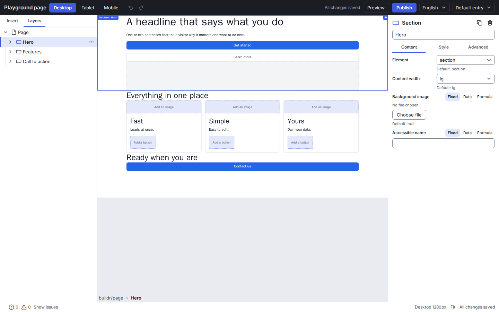

# Buildr

> An open-source Visual Page Builder for React and Next.js, with a first-class Payload CMS integration.

**Status: 1.0.** All `@next-buildr/*` packages are versioned together and released as 1.0.0: the document model, renderer, components, the visual editor (with its visual polish), the Next.js and Payload integrations and the MCP server for AI agents, with a reference application and end-to-end tests. Some things that were planned for 1.0 are not done; the honest list is in [docs/roadmap.md](docs/roadmap.md#known-gaps--not-in-100).



## Quickstart

Node >= 22 and pnpm >= 10:

```bash
# macOS / Linux / Git Bash
git clone https://github.com/czekanskyy/buildr.git && cd buildr
pnpm install
SEED_ADMIN_EMAIL=you@example.com SEED_ADMIN_PASSWORD='choose-a-password' pnpm --filter @next-buildr/example-next-payload seed
pnpm dev:example    # http://localhost:3000/pl, admin at /admin
```

```powershell
# Windows PowerShell (inline VAR=value does not work there)
git clone https://github.com/czekanskyy/buildr.git; cd buildr
pnpm install
$env:SEED_ADMIN_EMAIL = 'you@example.com'; $env:SEED_ADMIN_PASSWORD = 'choose-a-password'
pnpm --filter '@next-buildr/example-next-payload' seed
Remove-Item Env:SEED_ADMIN_EMAIL, Env:SEED_ADMIN_PASSWORD   # they stay set for the session otherwise
pnpm dev:example    # http://localhost:3000/pl, admin at /admin
```

Then open a page in the admin and click **Edit with Visual Builder**. The full walkthrough, and how to set environment variables on Windows, is in [docs/getting-started.md](docs/getting-started.md) ([PowerShell section](docs/getting-started.md#environment-variables-on-windows-powershell)).

## What Buildr is

- **A React/Next.js library** — a production renderer that turns a canonical JSON document (AST) into React Server Components.
- **A standalone visual editor** — a separate application (its own route, bundle and browser tab), not a screen embedded in a CMS admin panel.
- **A Payload CMS integration** — Payload stores documents and owns the workflow (drafts, autosave, versions, publishing, media, auth); the editor talks to it through a plugin and a documented HTTP contract.
- **Production-ready output** — the canvas and the live site use the same renderer and the same CSS, so what you edit is what ships.

## Core principles

- The core (`@next-buildr/core`) depends on neither React, Next.js nor Payload. Dependencies only point downward: `core → react → components`, `core → editor`, `core + react → next`, `core (+ next) → payload`.
- The document is a normalized JSON AST — never HTML or JSX — with schema versioning and forward-only migrations from day one.
- Every prop of every component can be static, bound to CMS data, or computed by a small, sandboxed expression language. There are no `Dynamic*` components.
- Styles are a typed model compiled to deterministic CSS with design tokens, cascade layers and desktop-first responsive overrides.
- One page structure serves all languages; translations live in the document, CMS data is fetched per locale.

## Packages

| Package | Purpose |
|---|---|
| `@next-buildr/core` | Document model, component registry metadata, values and bindings, expressions, styles → CSS, commands, history, migrations, validation, accessibility rules, drag-and-drop rules, canvas protocol |
| `@next-buildr/react` | Renderer (server, client, canvas runtime) and the component authoring API |
| `@next-buildr/components` | Standard components, templates (composites) and the default theme |
| `@next-buildr/editor` | The visual editor application (client-only) |
| `@next-buildr/next` | Next.js App Router integration: `BuildrPage`, draft mode, canvas/editor routes, metadata, caching |
| `@next-buildr/payload` | Payload plugin, data source, HTTP adapter for the editor, admin UI |
| `@next-buildr/mcp` | MCP server: lets AI agents build and edit pages through the same commands as the editor (stdio CLI and HTTP, drafts only, publishing opt-in) |

## Build pages with an AI agent

An agent (Claude Code, Claude Desktop, any MCP client) can discover the components, insert, style, translate and validate pages and save them as **drafts**; publishing is off unless you enable it. It uses commands, never raw HTML or JSON, so the result opens in the editor like any other page.

```bash
# macOS / Linux / Git Bash
BUILDR_MCP=1 pnpm dev:example    # then create an agent user with an API key in /admin
claude mcp add buildr --env BUILDR_API_KEY=<key> -- npx buildr-mcp --url http://localhost:3000
```

```powershell
# Windows PowerShell (the variable stays set for the session; remove it when done)
$env:BUILDR_MCP = '1'; pnpm dev:example    # then create an agent user with an API key in /admin
claude mcp add buildr --env BUILDR_API_KEY=<key> -- npx buildr-mcp --url http://localhost:3000
Remove-Item Env:BUILDR_MCP
```

Setup, prompts, tool reference and security notes: [docs/mcp.md](docs/mcp.md).

## Documentation

- [Architecture overview](docs/architecture.md) — start here
- [Core concepts](docs/core-concepts.md)
- [Roadmap, release status and known gaps](docs/roadmap.md)
- [Getting started](docs/getting-started.md) (including environment variables on Windows)
- [Releasing](docs/releasing.md)
- [Architecture Decision Records](docs/adr/README.md)
- [Implementation backlog](docs/backlog/README.md)
- [Building pages with AI agents (MCP server)](docs/mcp.md)
- [Guide for AI coding agents](AGENTS.md)

## Contributing

The project is built task by task from the [backlog](docs/backlog/README.md). Read [docs/contributing.md](docs/contributing.md) and [AGENTS.md](AGENTS.md) before opening a pull request.

## License

MIT (see `LICENSE`). The name “Buildr” is subject to a trademark policy; none has been published yet.
