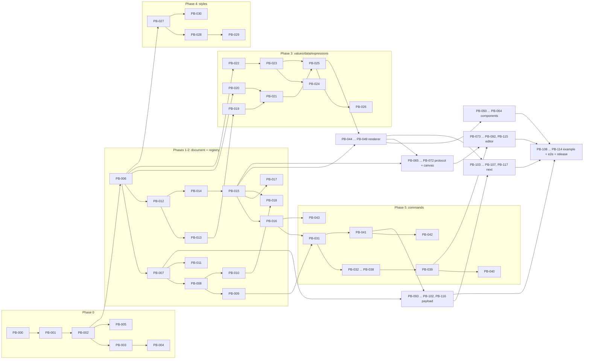

# Task dependency graph

## Critical path

The longest chain of tasks that must run strictly in sequence (roughly 20 sequential tasks):

`PB-000 -> 001 -> 002 -> 006 -> 012 -> 014 -> 015 -> 016 -> 031 -> 039 -> 074 -> 076 -> 086 -> 110 -> 112 -> 114`

A second, nearly-as-long branch feeds PB-076: `006 -> 012 -> 013 -> 019 -> 021 -> 025 -> 044/045 -> 047 -> 067`. PB-110 additionally depends on the Payload branch: `093 -> 094 -> 095 -> 100`.

## Suggested parallel work tracks (after PB-006 lands)

| Track | Tasks | Package |
|---|---|---|
| A: Document | 007-011 -> 031-040 | `core/document`, `core/commands` |
| B: Schema/Registry | 012-018 -> 043 | `core/schema`, `registry`, `rules`, `templates` |
| C: Values/Expressions | 019-026 (022-024 can start immediately after 006) | `core/values`, `data`, `expressions` |
| D: Styles | 027-030 | `core/styles` |
| E: Renderer + components | 044-049 -> 050-064 | `react`, `components` |
| F: Canvas | 065-072 | `core/protocol`, `react/canvas` |
| G: Editor | 073 (immediately after 002) -> 074-092, 115 | `editor` |
| H: Payload | 093 (after 007) -> 094-102, 116 | `payload` |
| I: Next + example | 103-107, 117 -> 108-114 | `next`, `apps` |

The full, authoritative dependency list lives in each task's own card under `docs/backlog/phase-*.md` — this graph is a navigational aid, not a substitute for reading the cards.
