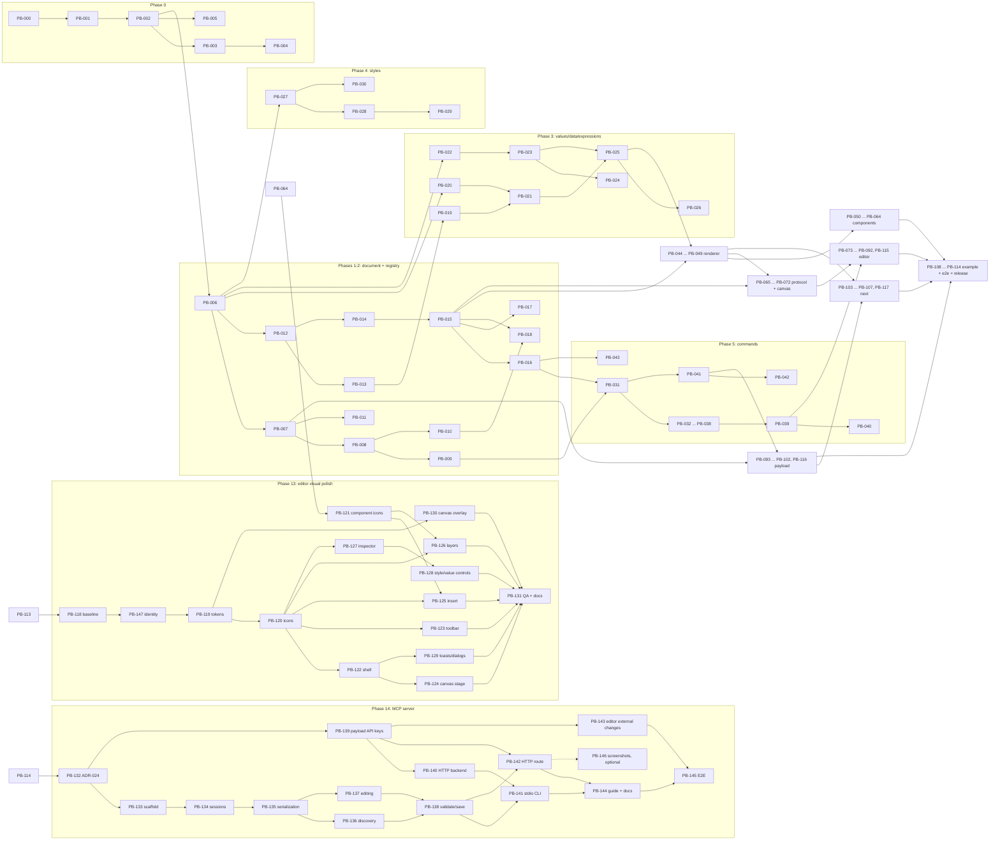

# Task dependency graph

## Critical path

The longest chain of tasks that must run strictly in sequence (roughly 20 sequential tasks):

`PB-000 -> 001 -> 002 -> 006 -> 012 -> 014 -> 015 -> 016 -> 031 -> 039 -> 074 -> 076 -> 086 -> 110 -> 112 -> 114`

A second, nearly-as-long branch feeds PB-076: `006 -> 012 -> 013 -> 019 -> 021 -> 025 -> 044/045 -> 047 -> 067`. PB-110 additionally depends on the Payload branch: `093 -> 094 -> 095 -> 100`.

## Suggested parallel work tracks (after PB-006 lands)

| Track | Tasks | Package |
|---|---|---|
| A: Document | 007-011 -> 031-040 | `core/document`, `core/commands` |
| B: Schema/Registry | 012-018 -> 043 | `core/schema`, `registry`, `rules`, `templates` |
| C: Values/Expressions | 019-026 (022-024 can start immediately after 006) | `core/values`, `data`, `expressions` |
| D: Styles | 027-030 | `core/styles` |
| E: Renderer + components | 044-049 -> 050-064 | `react`, `components` |
| F: Canvas | 065-072 | `core/protocol`, `react/canvas` |
| G: Editor | 073 (immediately after 002) -> 074-092, 115 | `editor` |
| H: Payload | 093 (after 007) -> 094-102, 116 | `payload` |
| I: Next + example | 103-107, 117 -> 108-114 | `next`, `apps` |

## Post-MVP tracks (phases 13 and 14)

The two phases are independent of each other and can run in parallel. They meet only in the editor's message catalogs (new strings from PB-143 and from the phase-13 tasks) — append-only edits that rebase trivially.

| Track | Tasks | Package |
|---|---|---|
| J: Editor visuals — foundation | 118 -> 147 -> 119 -> 120 (+ 121 in parallel) | `playground/e2e`, `editor/styles`, `editor/ui`, `components` |
| K: Editor visuals — areas (after 120, one agent per area) | 122, 123, 124, 125, 126, 127 -> 128, 129, 130 -> 131 | `editor/{app,toolbar,canvas-host,panels}`, `react/canvas` |
| L: MCP — tool layer | 132 -> 133 -> 134 -> 135 -> 136/137 -> 138 | `mcp` |
| M: MCP — site integration | 139 -> 140, 142, 143 | `payload`, `editor/persistence`, example app |
| N: MCP — delivery | 141, 144 -> 145 (146 optional) | `mcp/cli`, docs, e2e |

After PB-119 lands, the phase-13 area tasks each own a separate CSS partial (`styles/*.css`), which is what makes track K parallelisable without merge conflicts.

The full, authoritative dependency list lives in each task's own card under `docs/backlog/phase-*.md` — this graph is a navigational aid, not a substitute for reading the cards.
